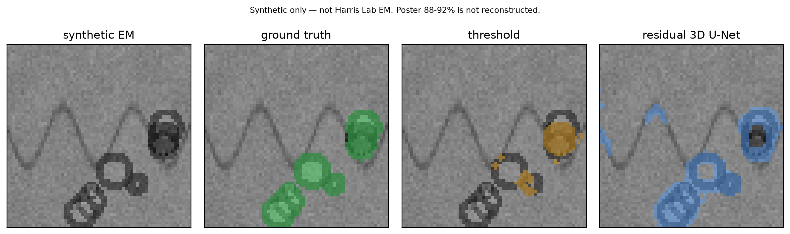

# vesicle-seg

**Clean-room scientific ML — synaptic-vesicle segmentation on synthetic EM-like volumes.**

Spec: [`SPEC.md`](SPEC.md).

```text
Raw EM-like volume → Zarr → adaptive overlapping chunks
  → residual 3-D U-Net (dropout; Dice + focal)
  → stitched prediction → overlays + vesicle density maps
```

## Demo artifact (real `make demo`)



Also: [`docs/overlay_unet.png`](docs/overlay_unet.png). Regenerated by `make demo` / `configs/ci.yaml`. Simulator only — not Harris Lab EM.

## Scope & honesty


Clean-room educational implementation using synthetic data. Reported metrics apply only to the included synthetic benchmark. Not clinical imaging software, not a medical device, and not for diagnosis or published biological measurements. Independent of Harris Lab code and data.

See [`PROVENANCE.md`](PROVENANCE.md) for poster-context and citation notes.

## Demo script (60–90s)

Cold-start demo walkthrough (suitable for screen recording).

### 0. Once

```bash
git clone https://github.com/kladak/vesicle-seg.git
cd vesicle-seg
python -m pip install -e ".[dev]"
# CPU torch is enough. If the wheel is missing: pip install torch --index-url https://download.pytorch.org/whl/cpu
```

### 1. Generate the Zarr store (~10s)

```bash
make generate
```

Point at `data/synthetic.zarr`: groups `syn_000`… with `raw`, `labels`, `instances`, `voxel_nm`.

### 2. Train + infer (~40s)

```bash
make demo          # configs/ci.yaml — residual 3D U-Net + threshold baseline
```

Walkthrough:

1. Volumes are **synthetic** ssEM-like cubes (8×64×64). Vesicles are 40–60 nm blobs; mitochondria-like ovals are unlabeled distractors.
2. Split is **by `volume_id`**, with raw-hash leakage checks.
3. Inference uses **overlapping chunks** and writes only the inner region to avoid tile-seam double-counting.
4. Open `reports/overlay_panel.png` — raw | GT | threshold | U-Net.
5. Open `reports/metrics.json` — Dice, F1, IoU, density / µm³ (**simulator scores only**).

### 3. Optional viewer (~15s)

```bash
make serve         # http://127.0.0.1:8765/viewer/
```

### 4. Close (~10s)

`make test` is what CI runs, plus `make train-ci`. No network. No lab data.

## What you get

| Piece | Path |
|-------|------|
| Spec | [`SPEC.md`](SPEC.md) |
| Experiment YAMLs | [`configs/ci.yaml`](configs/ci.yaml), [`configs/default.yaml`](configs/default.yaml) |
| Synthetic generator | [`vesicle_seg/synth/generate.py`](vesicle_seg/synth/generate.py) |
| Zarr store | [`vesicle_seg/store/zarr_store.py`](vesicle_seg/store/zarr_store.py) |
| Adaptive overlapping chunks | [`vesicle_seg/chunking/tiles.py`](vesicle_seg/chunking/tiles.py) |
| Leakage-aware split | [`vesicle_seg/data/splits.py`](vesicle_seg/data/splits.py) |
| Residual 3-D U-Net + Dice/focal | [`vesicle_seg/models/`](vesicle_seg/models/) |
| Threshold baseline | [`vesicle_seg/models/baseline.py`](vesicle_seg/models/baseline.py) |
| Train / stitched infer | [`vesicle_seg/train.py`](vesicle_seg/train.py), [`vesicle_seg/infer.py`](vesicle_seg/infer.py) |
| CLI | `python -m vesicle_seg.cli {generate,train,infer,demo,serve}` |
| CI | [`.github/workflows/ci.yml`](.github/workflows/ci.yml) |

## Synthetic CI metrics (real run, seed=42)

Produced by `make train-ci` (2026-09-14). **n_volumes=6**, shape `8×64×64`, voxel `(40, 4, 4)` nm, 8 epochs, leakage_ok=true. Simulator scores only. If this table disagrees with [`reports/metrics.example.json`](reports/metrics.example.json) / a fresh `reports/metrics.json`, **trust the JSON**.

| Model | Dice | IoU | F1 | pixel acc |
|-------|------|-----|----|-----------|
| threshold + morphology | 0.226 | 0.132 | 0.226 | 0.960 |
| resunet3d (8 epochs, CPU) | 0.460 | 0.304 | 0.460 | 0.973 |

On this draw the residual net beats the threshold floor on Dice / IoU / F1. Pixel accuracy is dominated by background and is the wrong headline metric. Density / µm³ is a count on a ~0.021 µm³ crop — a pipeline check, not a published bouton density.

Notes:

- Leakage-checked **volume-level** splits and overlapping-chunk stitch are implemented and tested.
- A **threshold + morphology** floor exists so the residual U-Net has something to beat on the simulator.
- Absolute Dice/IoU move with seed and `n_volumes`.

## Tests

```bash
make test
```

Covers generator determinism, Zarr round-trip, chunk coverage + stitch, id/hash leakage, Dice/IoU identities, U-Net shapes, baseline binary output, and a 1-epoch synthetic smoke train.

## License

MIT — see [`LICENSE`](LICENSE).
